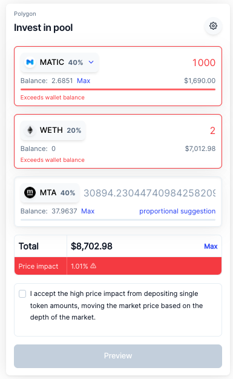

# Price Impact             WMATIC / MTA / WETH

Pool traits at the time of writing:

* _**Swap fee: 0.25%**_
* _**WMATIC: 273,763**_
* _**MTA: 1,023,625**_
* _**WETH: 66.0812**_
* _**Total BPT: 249494.507172**_

For this example, we will choose to deposit 1,000 WMATIC and 2 WETH without altering the total MTA within the pool. Our alternate example will use a deposit of 10,000 WMATIC and 2 WETH to solidify understanding in a slightly more complex scenario. These instances are referenced below.

Firstly, we will determine our spot prices of each token in terms of 1 BPT. This can be done using the reciprocal of the redemption function most conveniently, making our input 1 BPT. We will do this for WMATIC and for WETH.

_WMATIC_

_WETH_

Next, we can determine the amount of BPT our investments would be worth based upon the spot price, this assumes zero price impact is occurring and sets our base case.

From here we must determine what value of our BPT are disproportionate from the ratios of the pool for an evenly distributed deposit this can be done simply by multiplying the Total BPT by the weight of each token as follows.

$$
Proportionate \ BPT_{t} \ = \ W_{t} \ * \ Base \ Total \ BPT
$$

Using these values, we can determine how much of the total swap fee will be paid for each single token deposited. If our Base Value deposit for any token in BPT exceeds the Proportionate BPT deposit value, a swap fee will be implemented on the excess portion.

For example, because we deposited a Base Value of 364.5419683 BPT in WMATIC and the proportional deposit is 749.9135826 no swap fee will be implemented on the 1,000 WMATIC which were deposited. These will be crucial in determining our invariant ratio after the swap.

In the case of WETH our Base Value is 1510.241988 BPT, and proportional deposit is only 374.9567913 BPT. This yields the following calculation for a taxable amount:

Lastly, we must calculate our initial and post deposit invariant with fees to determine our net BPT and price impact based on the base case.

Our invariant ratio, multiplied by the initial total pool tokens, will yield the total pool tokens and therefore the amount which we will receive during our deposit. This value in comparison with our Base Case will determine our price impact.

