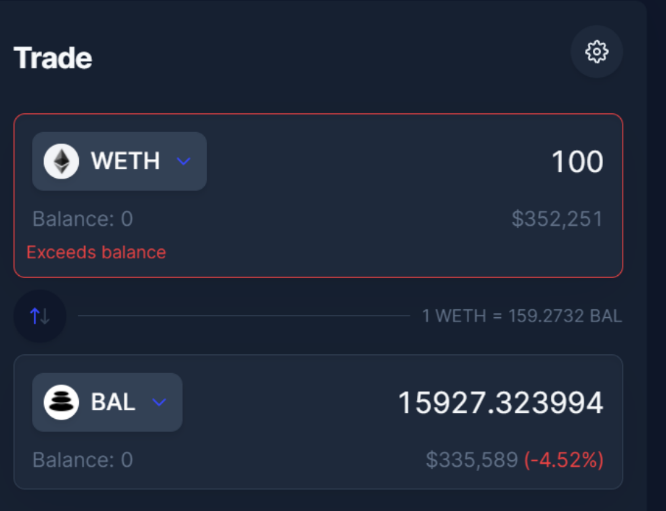
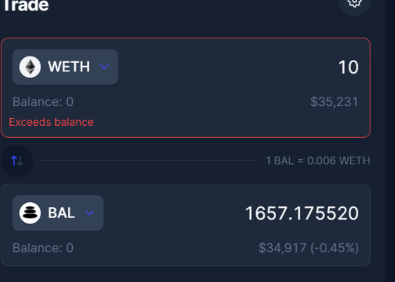

# Price Impact

Using our previous example from Arbitrum we can calculate the spot price using the equation from example 1 and from there determine the price impact using the following equation.

$$
Price \ Impact=PI_{i}^{o}=1- {\frac   {EP_{i}^{o}}{SP_{i}^{o}}}
$$

Spot price:

Finally we can calculate price impact for both instances of 10 WETH or 100 WETH trades. (Spot price is technically constant as long as the pool remains in its observed state.) Based on calculations&#x20;

This example was tested on the actual site in order to confirm this. However depending on the trade you may interact with different pools to receive the best price. Please note this value will always act against the trader, regardless of being presented as a positive or negative value.&#x20;

 

